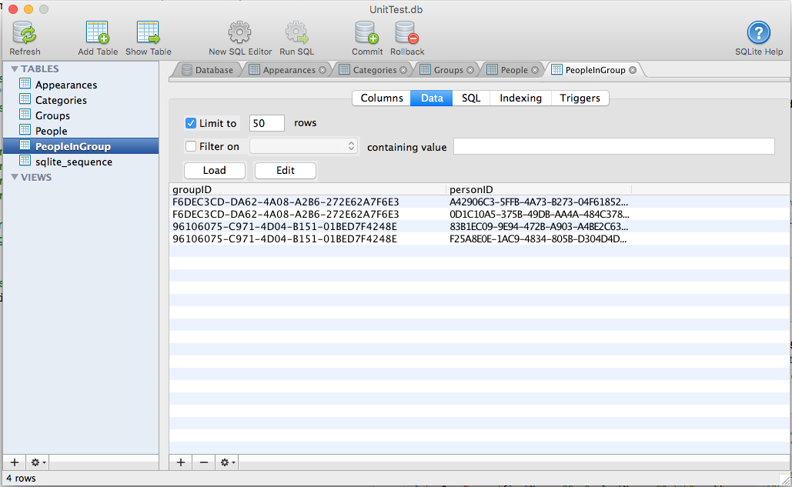

# Swiftlet Data for Swift and SwiftUI

        

**Swiftlet Data** is a suite of backend tools designed to quickly and easily add support for several common databases and data formats (such as **SQLite**, **SPON** and **CloudKit**) to your app.

 > NOTE: **Swiftlet Data** is a replacement for our [Action Data](https://github.com/Appracatappra/ActionData) library specifically designed to work with **SwiftUI**. Several other features have been modernized and improved as well.

## Support

If you find `SwiftletData` useful and would like to help support its continued development and maintenance, please consider making a small donation, especially if you are using it in a commercial product:

<a href="https://www.buymeacoffee.com/KevinAtAppra" target="_blank"></a>

It's through the support of contributors like yourself, I can continue to build, release and maintain high-quality, well documented Swift Packages like `SwiftletData` for free.

<a name="Installation"></a>
## Installation

**Swift Package Manager** (Xcode 11 and above)

1. In Xcode, select the **File** > **Add Package Dependency…** menu item.
2. Paste `https://github.com/Appracatappra/SwiftletData.git` in the dialog box.
3. Follow the Xcode's instruction to complete the installation.

> Why not CocoaPods, or Carthage, or blank?

Supporting multiple dependency managers makes maintaining a library exponentially more complicated and time consuming.

Since, the **Swift Package Manager** is integrated with Xcode 11 (and greater), it's the easiest choice to support going further.

## Overview

**Swiftlet Data** provides both light weight, low-level access to the data sources along with high level **Object Relationship Management** (ORM) support (using Swift's `Codable`, `Encodable` and `Decodable` protocols. 

Simply create a `Class` to hold your data and conform it to `ADDataTable`. After you open a datasource from the required type of provider (**SQLite**, **iCloud** or **SPON**), use ORM functionality to quickly **Save**, **Update** or **Query** data. All without the overhead or hassle of having to learn **Core Data**.

For example, if you had an instance of class `Category` that conforms to `ADDataTable` the following single line of code would create (or update the schema) of the required tables and write the values from the class into the table as a new record:

```swift
let category = Category(...)

// Save data to currently open SQLite database.
ADSQLiteProvider.shared.save(category)
```

And the following would do the same thing in iCloud using `CloudKit`:

```swift
let category = Category(...)

// Save data to the user's private iCloud data store.
ADiCloudProvider.shared.save(category)
```

You also have the option of saving to the Public iCloud Container visible by all user's of your app:

```swift
let category = Category(...)

// Save data to the public iCloud data store.
ADiCloudProvider.sharedPublic.save(category)
```

## What's Included

**Swiftlet Data** adds the following functionality:

* [Action Codable](#Action-Codable) - Uses Swift's  `Codable`, `Encodable` and `Decodable` protocols to move information between your data models and our portable `ADRecord` and `ADRecordSet` formats.
	* [Swift Portable Object Notation](#Swift-Portable-Object-Notation) - The new **Swift Portable Object Notation** (SPON) data format that allows complex data models to be encoded in a portable text string that encodes not only property keys and data, but also includes type information about the encoded data.
* [Swiftlet Data Providers](#Action-Data-Providers) - Provides light weight, low-level access and high-level **Object Relationship Management** (ORM) support to several common databases and data formats such as SQLite, SPON and CloudKit.
* [Action SQL Parser](#Action-SQL-Parser) - Provides the ability to parse text containing one or more SQL commands into an **Swiftlet Data SQL Document Object Model** (DOM) and is used to provide SQL support for data sources that don't support SQL natively (such as CloudKit and JSON).

<a name="Action-Codable"></a>
## Action Codable
 
**Action Codable** controls provide support for several common databases and data formats such as **SQLite**, **SPON** and **CloudKit** using Swift's `Codable`, `Encodable` and `Decodable` protocols to move information between your data models and our portable `ADRecord` and `ADRecordSet` formats.
 
With **Action Codable** and **Swiftlet Data Providers**, build your data model objects as simple `struct` or `class` objects and inherit from `ADDataTable`, then use **Action Controls** to quickly create, insert, update, delete and maintain the tables and records in the underlying data source. For example:

```swift
import Foundation
import SwiftletUtilities
import SwiftletData

class Category: ADDataTable {
    
    enum CategoryType: String, Codable {
	    case local
	    case web
	}
    
    static var tableName = "Categories"
    static var primaryKey = "id"
    static var primaryKeyType: ADDataTableKeyType = .computedInt
    
    var id = 0
    var added = Date()
    var name = ""
    var description = ""
    var enabled = true
    var highlightColor = UIColor.white.toHex()
    var type: CategoryType = .local
    var icon: Data = UIImage().toData()
    
    required init() {
        
    }
}
```

This includes support for complex tables with nested objects, arrays and dictionaries and complex relationships such as one-to-one, one-to-many and many-to-many. For example:

```swift
import Foundation
import SwiftletUtilities
import SwiftletData

struct Address: Codable {
    var addr1 = ""
    var addr2 = ""
    var city = ""
    var state = ""
    var zip = ""
}

class Person: ADDataTable {
    
    static var tableName = "People"
    static var primaryKey = "id"
    static var primaryKeyType = ADDataTableKeyType.autoUUIDString
    
    var id = UUID().uuidString
    var firstName = ""
    var lastName = ""
    var addresses: [String:Address] = [:]
    
    required init() {
        
    }
    
    init(firstName: String, lastName:String, addresses: [String:Address] = [:]) {
        self.firstName = firstName
        self.lastName = lastName
        self.addresses = addresses
    }
}

class Group: ADDataTable {
    
    static var tableName = "Groups"
    static var primaryKey = "id"
    static var primaryKeyType = ADDataTableKeyType.autoUUIDString
    
    var id = UUID().uuidString
    var name = ""
    var people = ADCrossReference<Person>(name: "PeopleInGroup", leftKeyName: "groupID", rightKeyName: "personID")
    
    required init() {
        
    }
    
    init(name: String, people: [Person] = []) {
        self.name = name
        self.people.storage = people
    }
}
```
<a name="Swift-Portable-Object-Notation"></a>
### Swift Portable Object Notation

**Action Codable** also introduces support for the new **Swift Portable Object Notation** (SPON) data format that allows complex data models to be encoded in a portable text string that encodes not only property keys and data, but also includes type information about the encoded data. For example, using the `Address` struct above:

```swift
@obj:Address<state$=`TX` city$=`Seabrook` addr1$=`25 Nasa Rd 1` zip$=`77586` addr2$=`Apt #123`>
```
The portable, human-readable string format encodes values with a single character _type designator_ as follows:
     
* `%` - Bool
* `!` - Int
* `$` - String
* `^` - Float
* `&` - Double
* `*` - Embedded `NSData` or `Data` value
     
Additionally, embedded arrays will be in the `@array[...]` format and embedded dictionaries in the `@obj:type<...>` format.

<a name="Action-Data-Providers"></a>
### Swiftlet Data Providers

**Swiftlet Data Providers** provide light weight, low-level access to several common databases and data formats such as **SQLite**, **SPON** and **CloudKit**. Results are returned as a key/value dictionary (`ADRecord`) or as an array of key/value dictionaries (`ADRecordSet`). For example:

```swift
let provider = ADSQLiteProvider.shared
let record = try provider.query("SELECT * FROM Categories WHERE id = ?", withParameters: [1])
print(record["name"])
```

Additionally, **Swiftlet Data Providers** provide high-level **Object Relationship Management** (ORM) functionality using **Action Codable** controls and data models conforming to the `ADDataTable` protocol. For example, using the `Address`, `Person` and `Group` data models presented above:

```swift
let addr1 = Address(addr1: "PO Box 1234", addr2: "", city: "Houston", state: "TX", zip: "77012")
let addr2 = Address(addr1: "25 Nasa Rd 1", addr2: "Apt #123", city: "Seabrook", state: "TX", zip: "77586")
    
let p1 = Person(firstName: "John", lastName: "Doe", addresses: ["home":addr1, "work":addr2])
let p2 = Person(firstName: "Sue", lastName: "Smith", addresses: ["home":addr1, "work":addr2])
    
let group = Group(name: "Employees", people: [p1, p2])
try provider.save(group)
```

Creates the `People`, `Group` and `PeopleInGroups` SQLite database tables (if required) and inserts the new record instances, with relationships, into the database. For example:



To retrieve the `Group` from the database, use the following:

```swift
let group = try provider.getRow(ofType: Group.self, forPrimaryKeyValue: "F6DEC3CD-DA62-4A08-A2B6-272E62A7F6E3")
```

The **Swiftlet Data Providers** are designed to be interchangeable, so you can start developing locally using a SQLite database and a `ADSQLiteProvider`, then later switch to CloudKit and a `ADiCloudProvider` without have to change any of your other code.

Additionally, **Swiftlet Data Providers** can be used to move data from one source to another. For example, download data from the web in JSON  and save it to a local SQLite database using a `ADSQLiteProvider`, all with a minimal of code.

<a name="Action-SQL-Parser"></a>
## Action SQL Parser

The `ADSQLParser` provides the ability to parse text containing one or more SQL commands into an **Swiftlet Data SQL Document Object Model** (DOM) and is used to provide SQL support for data sources that don't support SQL natively (such as **CloudKit**).

The `ADSQLParser` uses SQLite's SQL syntax and currently support a subset of the full SQL language. For example:

```swift
let sql = """
CREATE TABLE IF NOT EXISTS parts
(
	part_id           INTEGER   PRIMARY KEY,
	stock             INTEGER   DEFAULT 0   NOT NULL,
	description       TEXT      CHECK( description != '' )    -- empty strings not allowed
);
"""

let instructions = try ADSQLParser.parse(sql)
print(instructions)
```

# Documentation

The **Package** includes full **DocC Documentation** for all features.